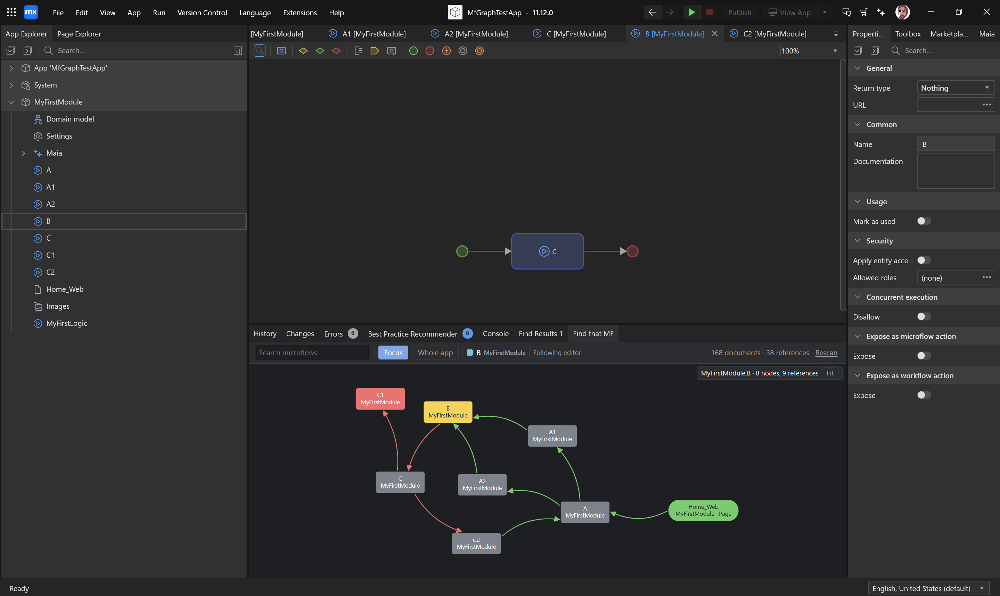

# Find That MF

A microflow call graph inside Mendix Studio Pro. It answers three questions without leaving the IDE:

- **What calls this microflow?** — pages, nanoflows, workflows, scheduled events, entity event
  handlers, published REST/OData/web service operations, menu items and mappings, not just other
  microflows.
- **What does it call?**
- **Is anything calling it at all?** — with Mendix's **Mark as used** flag respected, so the unused
  list is safe to act on.



Focused on a microflow, the graph reads as flow: the focus is yellow, everything that leads into it
is green, everything downstream is red. Entry points — anything with no callers, like the
`Home_Web` page above — are green; dead ends are red. Node shape tells you the document type and
colour tells you the module.

---

## Install

Two ways. Both need Studio Pro **11** (built and tested against 11.12).

### As an add-on module (one file)

Download `FindThatMF.mxmodule` from
[Releases](https://github.com/Joshua-TOF/find-that-mf/releases), then in Studio Pro:

1. Right-click your app in **App Explorer** → **Import module package**.
2. Pick the `.mxmodule`.
3. Studio Pro asks whether to **trust the extension** it contains. Accept — if you decline, the
   module imports but the extension never loads.

The module is protected, so nobody can edit or accidentally delete its contents.

### As a folder

Download the zip from the same place and unzip it into your app's `extensions\` folder, so you end
up with:

```
<your-app>\extensions\find-that-mf\manifest.json
```

### Either way: extension loading must be enabled

Studio Pro ignores extensions silently unless it is told to load them — no error, no log line, they
simply never appear. Turn it on once in **Preferences → Advanced → Extension Development**, or
launch with the flag:

```
studiopro.exe "C:\Mendix\MyApp\MyApp.mpr" --enable-extension-development
```

`tools\run-studiopro.cmd -Mpr "C:\Mendix\MyApp\MyApp.mpr"` does the latter for you and finds the
newest installed Studio Pro 11 by itself.

> Whether a *trusted add-on module* still needs this is not something Mendix documents, and it is
> untested here. If the pane does not appear after importing the module, that setting is the first
> thing to check.

<details>
<summary>Or build it from source</summary>

```powershell
cd extension
npm install
npm run build
```

`MX_APP_DIR` picks the app to deploy into; the default is `..\testapp`.

```powershell
$env:MX_APP_DIR = "C:\Mendix\MyApp"
npm run build
```

</details>

---

## Use it

The **Find that MF** tab appears in the bottom dock at startup, beside Errors and Console. If you
close it, **Extensions → Find That MF → Show microflow graph** brings it back.

| | |
|---|---|
| **Search** | Type a name to jump to any microflow, page, or other document |
| **Focus / Whole app** | One microflow's neighbourhood, or every connection in the app |
| **Following editor** | The graph follows whichever document you open. Click the chip to pin it |
| **Modules** | In whole-app view, a dropdown filters which modules are drawn — it doubles as the colour legend |
| **Click a node** | Opens that document |
| **Double-click a node** | Refocuses the graph on it |
| **Hover a node** | Shows its documentation and usage |
| **Drag / wheel / Fit** | Pan, zoom, reset |

A ⚠ badge marks a document nothing calls; 🔒 marks one with **Mark as used** ticked, which
suppresses the warning. That flag exists because a call graph cannot see `Core.execute` from a Java
action, so a microflow only Java calls would otherwise look dead.

### Checking a real app

`npm run validate` runs the same scanner headlessly over any `.mpr`, and finishes with a
completeness audit that brute-force searches the raw model for every document it called unused —
so a false "unused" gets reported as a suspected miss rather than trusted.

```powershell
cd extension
npm run validate -- "C:\path\to\YourApp.mpr"
```

---

## Develop

```powershell
cd extension
npm install
npm run build:dev      # watch, redeploying on every change
npm test               # 73 unit tests, no Studio Pro needed
```

```
extension/src/main/    registration and the graph index — all model I/O lives here
extension/src/graph/   scanner, index, wire protocol, shared types
extension/src/ui/      the bottom-dock pane and the graph it hosts
extension/test/        vitest
tools/                 launch scripts
```

The test app is not in this repository. [NOTES.md](NOTES.md) explains how to rebuild it, and covers
how the scanner and views work, what was measured, and the Studio Pro API behaviours worth knowing
before changing anything.

---

## Known limits

- **Project-level microflows** — after-startup, before-shutdown and health-check are not exposed by
  the model API, so they show as uncalled. Mark them as used.
- **`Core.execute` from Java** is invisible unless the microflow is passed as a Java action
  parameter. That is what Mark as used is for.
- **The pane cannot be restored, only opened**, so it takes the dock's focus at each launch;
  `panes.register` mints a new GUID every time and Studio Pro's saved layout cannot find it again.
  `AUTO_OPEN_PANE` in `src\main\index.ts` turns that off.
- The **System** module is skipped.

## Licence

MIT — see [LICENSE](LICENSE).
